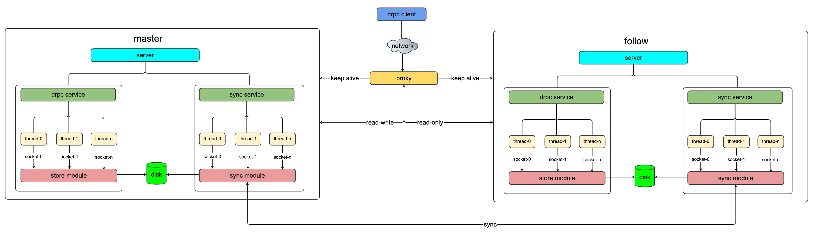
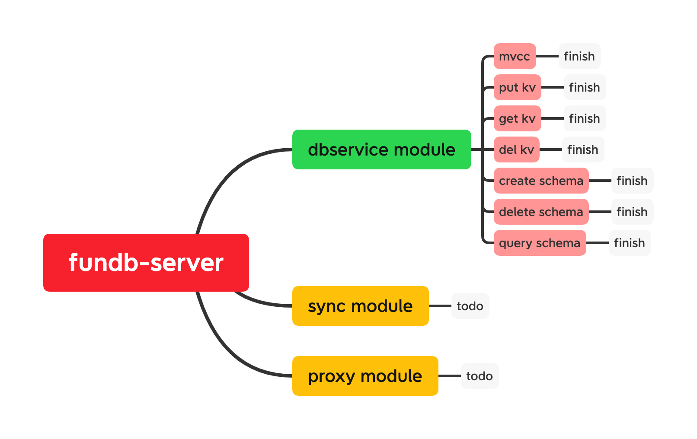

# fundb_server



### 编译drpc服务端和客户端

```
$ git clone git@github.com:perrynzhou/fundb-server.git
$ cd fundb-server/ && ./build.sh

```

### 编译存储enngine服务

```
$ cd fundb-server/module/dbservice && ./build.sh
// demo 是配置服务的存储服务，/tmp是数据库存储路径,4代表线程数
$ ./engine conf.json
```

### 启动dbserver服务

```
// 启动kv 的存储服务，接受哦来自drpc服务端的请求
$ cd cmd && dbserver -c conf.json
```
### 客户端请求示例
```
// 请求创建创建schema
$ cd cmd && dbclient -n 3
//删除schema
$ ./dbclient  -t drop_schema -n 10
// put kv
$ dbclient -t put_kv -n 3
// get kv
$ dbclient -t get_kv -n 3

```
## conf-server项目进度
