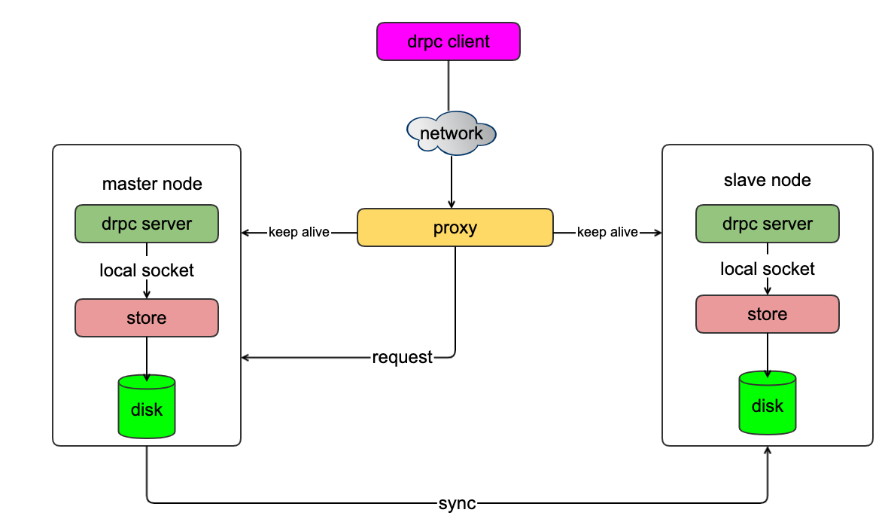

# conf_server



### 编译drpc服务端和客户端

```
$ git clone git@github.com:perrynzhou/conf-server.git
$ cd conf-server/ && ./build.sh

```

### 编译libev
```
$ cd conf-server/module/libev && ./configure && make && make install
```
### 编译store服务

```
$ cd conf-server/module/store && make
// demo 是配置服务的存储服务，/tmp是数据库存储路径,4代表线程数
$ ./test_server demo /tmp 4
```

### 启动服务

```
// 启动kv 的存储服务，接受哦来自drpc服务端的请求
$ cd conf-server && ./test_server
```
### 请求示例
```
// 请求创建test_server
$ cd conf-server && ./test_server
```
## conf-server项目进度
